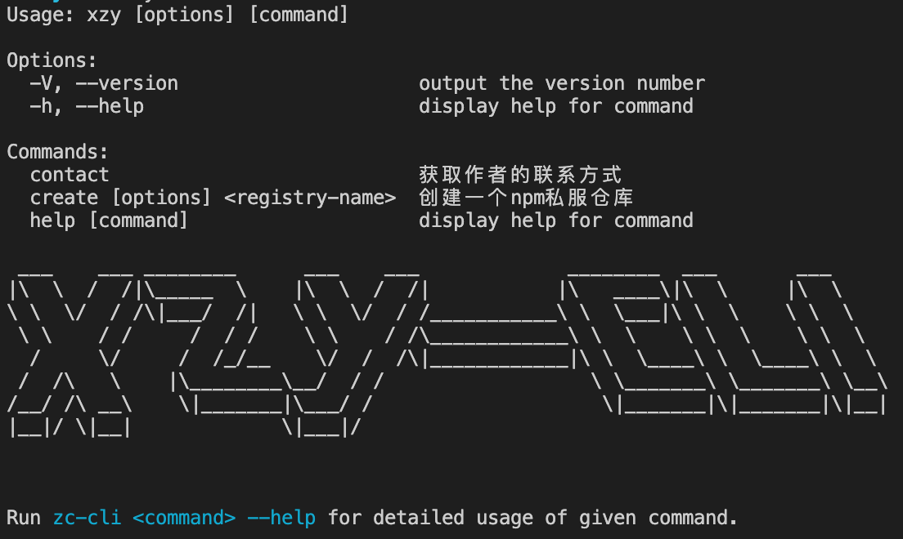

# @csuxzy/xzy-cli
> 快速生成vitepress文档（vuepress支持中），省去配置时间



## Install
> 环境要求 node >= 14.18.2

```sh
npm  install @csuxzy/xzy-cli -g
```

## Usage

```sh
# 在当前目录生成文档
xzy create project
# 在指定路径生成文档
xzy create project --context yourPath
# 获取帮助
xzy --help
# 获取作者联系方式
xzy contact
# 当前版本
xzy --version
```
