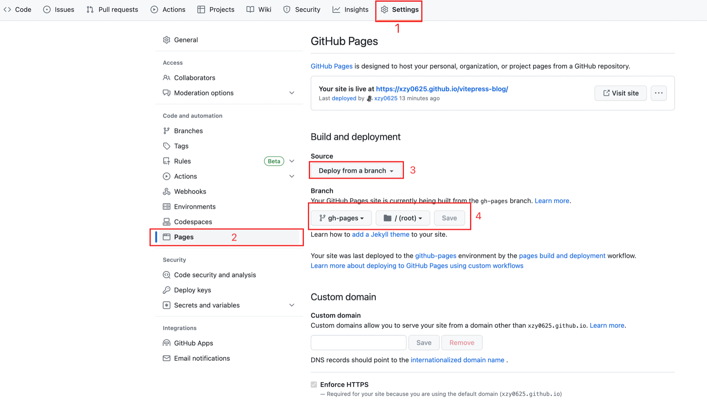
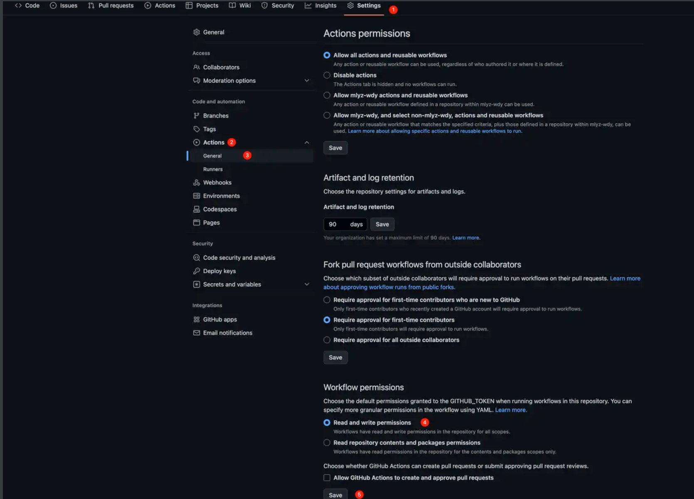
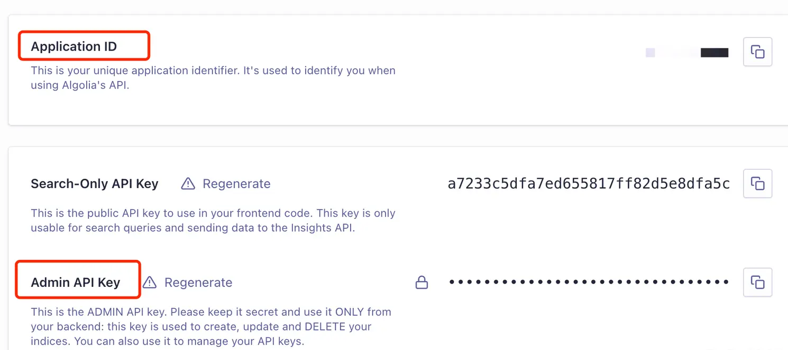
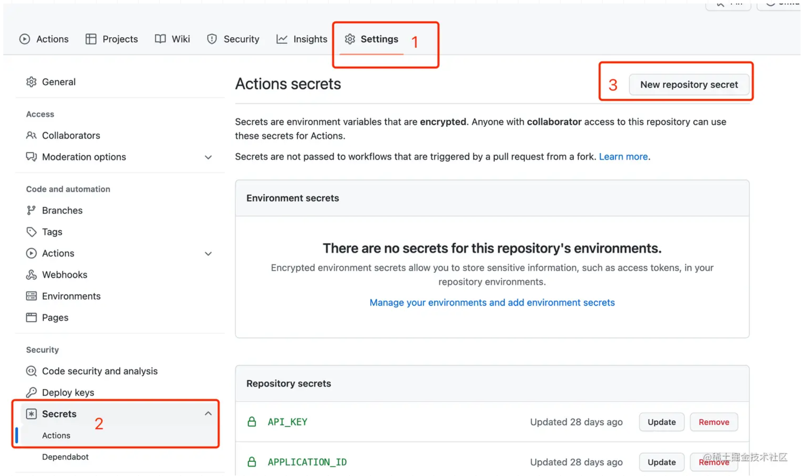
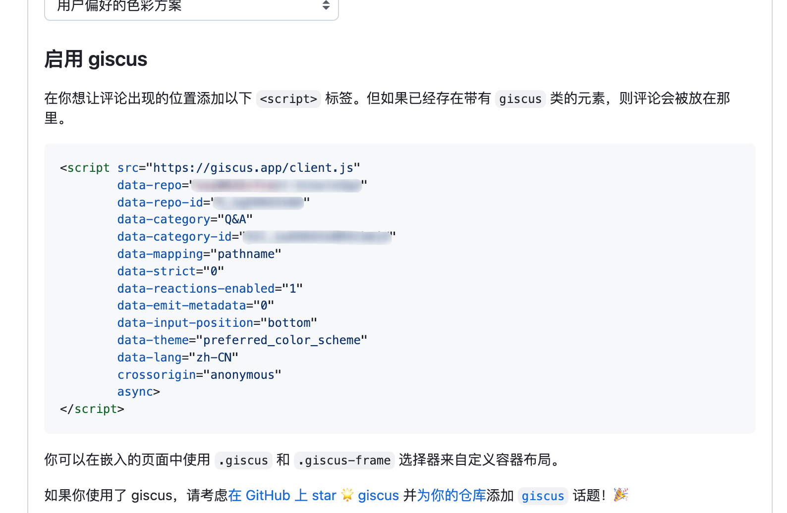
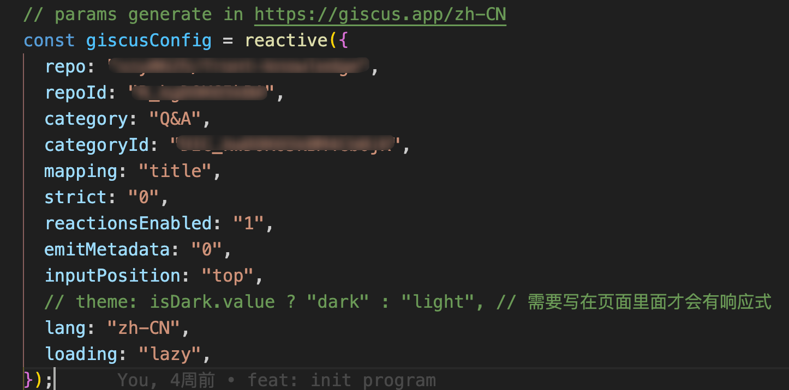

# vitepress-blog

## 快速开始
```bash
cd ./{projectName}
yarn
yarn dev
```

## github pages部署
### 一：新建仓库
新建github仓库，并将本项目和仓库进行关联

### 二：检查deploy.yml

1. `.github/workflows/deploy.yml `放置github action文件，当我们push项目到远程之后会自动触发acion。
2. ***需特别注意配置中我们监听的分支，如果你的主分支为main，请更改为main*

> on:
>
>   push:
>
> ​    branches:
>
> ​      \- master

### 三：开启github pages

> 注意gh-pages分支只有在构建完一次action之后才会存在



如遇到问题

> GitHub Action: The process ‘/usr/bin/git‘ failed with exit code 128

解决方式



等待一会儿则可完成`pages`的部署

## 启用Algolia搜索

### 参考文档
1. https://juejin.cn/post/7157340749065895944
2. https://juejin.cn/post/7161320316285747231
3. https://juejin.cn/post/7070109475419455519

### 更改配置

> 注意只有页面部署成功之后才会执行爬虫，所以可能第一次`Algolia`索引里面没有数据，但是第二次就会有了

1. https://dashboard.algolia.com/account/plan/create?planName=grow 新建`Algolia`应用并获取`applicationId`和`apiKey`

   

2. 更改`.vitepress.config.js`下`algolia`配置

3. 更改`crawlerConfig.json`下的`index_name`为`Algolia`创建的索引。

4. 更改`crawlerConfig.json`下`start_urls`为部署之后页面的链接。例如部署到`github pages`就填对应的`pages`链接

5. 将 `Application ID `和 `Admin API Key `设置到仓库（Github）的` Secrets`
   

## 配置 giscus

1. https://giscus.app/zh-CN 填写完仓库等基本信息之后会得到如下的配置。



2. 将配置填入到`.vitepress/theme/components/Comment.vue`组件的`giscusconfig`中



## 其他配置

`docs/.vitepress/config.js`文件的内容请参照vitepress自行配置

## vitepress参考文档
[vitepress](https://vitepress.dev/reference/default-theme-last-updated)
https://process1024.github.io/vitepress/guide/theme-search
https://juejin.cn/post/7164276166084263972